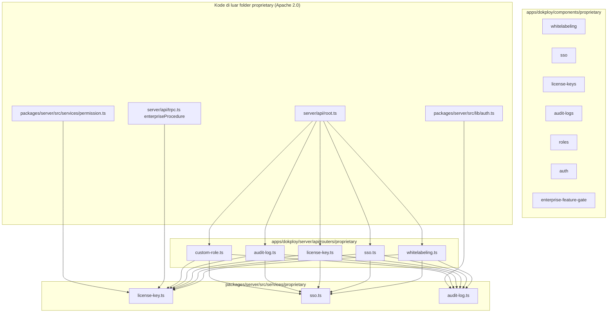

# Peta kode: area **proprietary** (DSAL) vs integrasi

Dokumen ini memetakan isi repositori yang berada di bawah jalur `**/proprietary/**` sebagaimana dirujuk [`LICENSE.MD`](./LICENSE.MD) (bagian tersebut mengikuti [`LICENSE_PROPRIETARY.md`](./LICENSE_PROPRIETARY.md) — DSAL v1.0).

> **Bukan nasihat hukum.** Untuk produksi komersial, baca teks DSAL dan konsultasikan ke Dokploy atau penasihat hukum.

---

## 1. Ringkasan cepat

| Kategori                                | Jumlah berkas (per snapshot repo) | Lokasi akar                                    |
| --------------------------------------- | --------------------------------- | ---------------------------------------------- |
| UI React (`components/proprietary`)     | 15                                | `apps/dokploy/components/proprietary/`         |
| Router tRPC (`routers/proprietary`)     | 5                                 | `apps/dokploy/server/api/routers/proprietary/` |
| Layanan server (`services/proprietary`) | 3                                 | `packages/server/src/services/proprietary/`    |
| **Total di bawah `proprietary/`**       | **23**                            | —                                              |

Fitur yang **utamanya** diwujudkan di folder DSAL ini:

- Lisensi enterprise & gate UI (`license-key`, `enterprise-feature-gate`)
- Whitelabeling (logo, CSS, halaman error, dll.)
- SSO (OIDC/SAML) — UI + API router
- Audit log (UI + API + `createAuditLog` di server)
- Custom roles (UI + router)
- Tombol login OAuth (GitHub / Google) pada halaman publik

### Arsip referensi di folder `asli/`

Salinan **struktur path yang sama** disimpan di [`asli/`](./asli/README.md) untuk acuan saat Anda menulis ulang implementasi tanpa menyalin kode DSAL ke modul baru.

| Lokasi arsip                                        | Setara path aktif (build)                      |
| --------------------------------------------------- | ---------------------------------------------- |
| `asli/apps/dokploy/components/proprietary/`         | `apps/dokploy/components/proprietary/`         |
| `asli/apps/dokploy/server/api/routers/proprietary/` | `apps/dokploy/server/api/routers/proprietary/` |
| `asli/packages/server/src/services/proprietary/`    | `packages/server/src/services/proprietary/`    |

Detail alur kerja: [`asli/README.md`](./asli/README.md).

---

## 2. Diagram alir dependensi (tinggi)



---

## 3. Inventaris lengkap: `apps/dokploy/components/proprietary/`

| Jalur                                      | Peran singkat                                            |
| ------------------------------------------ | -------------------------------------------------------- |
| `enterprise-feature-gate.tsx`              | Gate UI: hanya render anak jika license enterprise valid |
| `license-keys/license-key.tsx`             | Halaman pengaturan license key (aktivasi / validasi)     |
| `whitelabeling/whitelabeling-provider.tsx` | Injeksi CSS/metadata publik dari konfigurasi whitelabel  |
| `whitelabeling/whitelabeling-settings.tsx` | Form pengaturan whitelabel                               |
| `whitelabeling/whitelabeling-preview.tsx`  | Pratinjau tampilan whitelabel                            |
| `sso/sign-in-with-sso.tsx`                 | Alur login SSO (Better Auth)                             |
| `sso/sso-settings.tsx`                     | Pengaturan provider SSO                                  |
| `sso/register-oidc-dialog.tsx`             | Dialog pendaftaran provider OIDC                         |
| `sso/register-saml-dialog.tsx`             | Dialog pendaftaran provider SAML                         |
| `auth/sign-in-with-github.tsx`             | Tombol / alur sign-in GitHub (publik)                    |
| `auth/sign-in-with-google.tsx`             | Tombol / alur sign-in Google (publik)                    |
| `audit-logs/show-audit-logs.tsx`           | Halaman daftar audit log + gate                          |
| `audit-logs/data-table.tsx`                | Tabel data audit                                         |
| `audit-logs/columns.tsx`                   | Definisi kolom tabel audit                               |
| `roles/manage-custom-roles.tsx`            | Manajemen custom role + gate                             |

---

## 4. Inventaris lengkap: `apps/dokploy/server/api/routers/proprietary/`

| Jalur              | Peran singkat                                                              |
| ------------------ | -------------------------------------------------------------------------- |
| `whitelabeling.ts` | tRPC: get / update / reset whitelabel (`enterpriseProcedure` untuk mutasi) |
| `sso.ts`           | tRPC: provider SSO, trusted origins, `showSignInWithSSO`                   |
| `license-key.ts`   | tRPC: aktivasi, validasi, nonaktif license (memanggil API Dokploy)         |
| `audit-log.ts`     | tRPC: query audit log (bergantung pada `hasValidLicense`)                  |
| `custom-role.ts`   | tRPC: CRUD custom role (`enterpriseProcedure`)                             |

Router di atas diregistrasikan di `apps/dokploy/server/api/root.ts` (impor `auditLogRouter`, `customRoleRouter`, `licenseKeyRouter`, `ssoRouter`, `whitelabelingRouter`).

---

## 5. Inventaris lengkap: `packages/server/src/services/proprietary/`

| Jalur            | Peran singkat                                                                                          |
| ---------------- | ------------------------------------------------------------------------------------------------------ |
| `license-key.ts` | `hasValidLicense(organizationId)` — cek owner: `enableEnterpriseFeatures` + `isValidEnterpriseLicense` |
| `sso.ts`         | Utilitas SSO, mis. `getOrganizationOwnerId` (dipakai license & SSO)                                    |
| `audit-log.ts`   | `createAuditLog`, `getAuditLogs` — pencatatan & pembacaan log                                          |

**Ekspor publik paket** (`packages/server/src/index.ts`):

- `export * from "./services/proprietary/license-key"`
- `export * from "./services/proprietary/sso"`

---

## 6. Halaman & titik masuk yang **mengimpor** modul proprietary

Berkas ini **tidak** berada di dalam `proprietary/`, tetapi **bergantung** padanya (untuk refactor / audit lisensi):

| Jalur                                                                  | Keterangan                                        |
| ---------------------------------------------------------------------- | ------------------------------------------------- |
| `apps/dokploy/pages/_app.tsx`                                          | `WhitelabelingProvider`                           |
| `apps/dokploy/pages/index.tsx`                                         | GitHub/Google/SSO sign-in                         |
| `apps/dokploy/pages/register.tsx`                                      | GitHub/Google sign-in                             |
| `apps/dokploy/pages/dashboard/settings/license.tsx`                    | `LicenseKeySettings`                              |
| `apps/dokploy/pages/dashboard/settings/whitelabeling.tsx`              | `EnterpriseFeatureGate` + `WhitelabelingSettings` |
| `apps/dokploy/pages/dashboard/settings/sso.tsx`                        | `EnterpriseFeatureGate` + `SSOSettings`           |
| `apps/dokploy/pages/dashboard/settings/audit-logs.tsx`                 | `ShowAuditLogs`                                   |
| `apps/dokploy/pages/dashboard/settings/users.tsx`                      | `ManageCustomRoles`                               |
| `apps/dokploy/components/dashboard/settings/users/add-permissions.tsx` | `EnterpriseFeatureLocked`                         |
| `apps/dokploy/server/api/root.ts`                                      | Menggabung router proprietary                     |
| `apps/dokploy/server/api/trpc.ts`                                      | `enterpriseProcedure` → `hasValidLicense`         |
| `apps/dokploy/server/api/routers/server.ts`                            | `hasValidLicense`                                 |
| `apps/dokploy/server/api/routers/user.ts`                              | `hasValidLicense`                                 |
| `apps/dokploy/server/api/routers/git-provider.ts`                      | `hasValidLicense`                                 |
| `apps/dokploy/server/api/utils/audit.ts`                               | `createAuditLog`                                  |
| `packages/server/src/lib/auth.ts`                                      | `createAuditLog`                                  |
| `packages/server/src/services/permission.ts`                           | `hasValidLicense`                                 |
| `packages/server/src/services/git-provider.ts`                         | `hasValidLicense`                                 |
| `packages/server/src/services/server.ts`                               | `hasValidLicense`                                 |
| `apps/dokploy/__test__/permissions/*.test.ts`                          | Mock `license-key`                                |

---

## 7. Skema data terkait (di luar folder `proprietary/`, biasanya Apache)

Kolom dan tabel berikut **mendukung** fitur enterprise tetapi berkas skemanya tidak berada di `**/proprietary/**`:

| Lokasi                                                 | Isi relevan                                                                               |
| ------------------------------------------------------ | ----------------------------------------------------------------------------------------- |
| `packages/server/src/db/schema/user.ts`                | `enableEnterpriseFeatures`, `licenseKey`, `isValidEnterpriseLicense`, `trustedOrigins`, … |
| `packages/server/src/db/schema/sso.ts`                 | Tabel / skema `sso_provider` (OIDC/SAML)                                                  |
| `packages/server/src/db/schema/web-server-settings.ts` | `whitelabelingConfig` (JSON)                                                              |

Migrasi Drizzle di `apps/dokploy/drizzle/` mendefinisikan perubahan skema ini.

---

## 8. Kode enterprise / license **di luar** path `proprietary/`

Menurut [`LICENSE.MD`](./LICENSE.MD), pemisahan DSAL hanya untuk konten yang **berada di** direktori bernama `proprietary`. Berkas berikut **tidak** di path `**/proprietary/**` tetapi erat dengan license enterprise:

| Jalur                                           | Fungsi                                                       |
| ----------------------------------------------- | ------------------------------------------------------------ |
| `apps/dokploy/server/utils/enterprise.ts`       | HTTP ke `LICENSE_KEY_URL` — activate / validate / deactivate |
| `packages/server/src/utils/crons/enterprise.ts` | `LICENSE_KEY_URL` + cron validasi berkala                    |
| `apps/dokploy/server/api/trpc.ts`               | `enterpriseProcedure` (gate API selain UI)                   |

Endpoint lisensi (bawaan kode): `https://licenses-api.dokploy.com` (lihat `packages/server/src/utils/crons/enterprise.ts`).

---

## 9. Matriks fitur ↔ lokasi DSAL

| Fitur           | UI (components/proprietary)     | API (routers/proprietary) | Service (services/proprietary)    |
| --------------- | ------------------------------- | ------------------------- | --------------------------------- |
| License key     | `license-keys/*`                | `license-key.ts`          | `license-key.ts`                  |
| Gate enterprise | `enterprise-feature-gate.tsx`   | —                         | `license-key.ts` (via impor lain) |
| Whitelabel      | `whitelabeling/*`               | `whitelabeling.ts`        | — (baca `webServerSettings`)      |
| SSO             | `sso/*`                         | `sso.ts`                  | `sso.ts`                          |
| Audit log       | `audit-logs/*`                  | `audit-log.ts`            | `audit-log.ts`                    |
| Custom roles    | `roles/manage-custom-roles.tsx` | `custom-role.ts`          | —                                 |

---

## 10. Checklist untuk fork / hosting komersial

1. **Inventaris:** gunakan bagian 3–5 sebagai daftar berkas DSAL.
2. **Integrasi:** tinjau bagian 6–8 untuk berkas yang harus diubah jika Anda menghapus atau mengganti modul proprietary.
3. **Skema DB:** bagian 7 — migrasi dan data production harus konsisten dengan keputusan Anda soal enterprise.
4. **Lisensi:** baca DSAL di [`LICENSE_PROPRIETARY.md`](./LICENSE_PROPRIETARY.md); adendum pribadi ada di [`LICENSE_PROPRIETARY_ADDENDUM.md`](./LICENSE_PROPRIETARY_ADDENDUM.md) (tidak menggantikan DSAL/Apache upstream).

---

## 11. Cara memverifikasi ulang di mesin Anda

```bash
# Semua berkas di bawah jalur proprietary (sumber kebenaran peta ini)
find . -type f \( -path '*/components/proprietary/*' -o -path '*/routers/proprietary/*' -o -path '*/services/proprietary/*' \) ! -path './node_modules/*' | sort
```

---

*Dokumen ini dibuat untuk mempermudah audit teknis dan diskusi lisensi; tanggal referensi struktur repo: snapshot lokal fork.*
